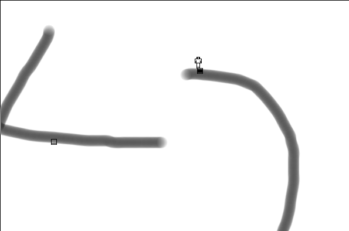

# game

There's a dude. The dude can move around the screen using W, S, A, D. The
dude can not walk outside the limits of the map. It's big map and the
screen pans when the dude approaches the edge. There are boxes
randomly distributed on the map. When the dude is intersecting a box, the
dude can open and close the box by pressing space. When the dude opens a
box for the first time, a new box is placed somewhere on the map at random.
After a box has been opened and closed five times, it disappears.

